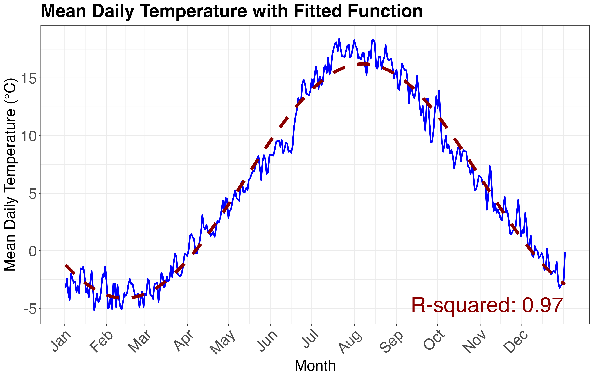

# Climate Data Analysis (2008–2023)

This repository contains R code and cleaned data for analyzing historical climate patterns — specifically temperature, rainfall, and photoperiod — from 2008 to 2023. The analysis supports climate-driven ecological modeling, particularly for use in mosquito population dynamics research.

## Overview

The workflow includes:
- Cleaning and restructuring daily climate datasets
- Summarizing seasonal and inter-annual patterns
- Plotting trends in temperature, total rainfall, and photoperiod
- Fitting periodic functions to climate variables
- Calculating and visualizing goodness-of-fit (R²) values

## Features

- Daily data processed and visualized over a 16-year period
- Seasonal photoperiod curve fitting using trigonometric functions
- Rainfall and temperature trend analysis with annotated plots
- Modular R scripts for reproducibility

## 📊 Example Output


## Repository Structure

```r
climate-data-analysis/
├── data/ # Raw and cleaned climate data (CSV)
├── code/ # R scripts and R Markdown files
├── figures/ # Output plots and trend visualizations
└── README.md # Project description and instructions
```


## Tools & Packages

- R (`dplyr`, `lubridate`, `ggplot2`, `stats`, `readr`)
- Periodic function fitting using nonlinear regression
- Plot customization with `ggplot2` and `patchwork`

## How to Run

To reproduce the full analysis and generate plots, knit the R Markdown file:

```r
rmarkdown::render("code/climate_analysis_summary.Rmd")
```
